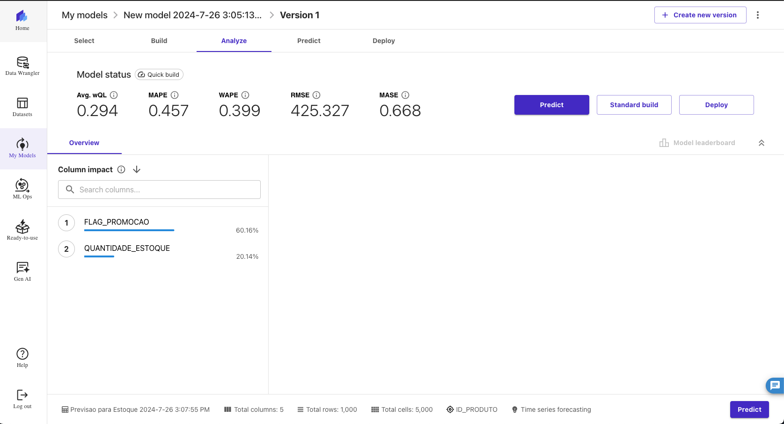

# 📊 Previsão de Estoque Inteligente na AWS com [SageMaker Canvas](https://aws.amazon.com/pt/sagemaker/canvas/)

Desafio de projeto "Previsão de Estoque Inteligente na AWS com SageMaker Canvas. Neste Lab DIO, aprendi a usar o SageMaker Canvas para criar previsões de estoque baseadas em Machine Learning (ML).

## 🎯 Objetivos Deste Desafio de Projeto (Lab)

## 🚀 Passo a Passo

### 1. Selecionar Dataset

-   Escolha do dataset que foi usado para treinar o modelo de previsão de estoque.
-   Feito o upload do dataset no SageMaker Canvas.
-   Dataset escolhido:1000 produtos com preços promocionais e renovação de estoque

### 2. Construir/Treinar

-   No SageMaker Canvas, foi importado o dataset selecionado.
-   Configurado as variáveis de entrada e saída de acordo com os dados.
-   Iniciado o treinamento do modelo.

### 3. Analisar

-   Após o treinamento, foi feito analise das métricas de performance do modelo.
-   Verificado as principais características que influenciam as previsões.

### 4. Prever

-   Modelo treinado para fazer previsões de estoque.
-  Exportado os resultados e analise das previsões geradas.

